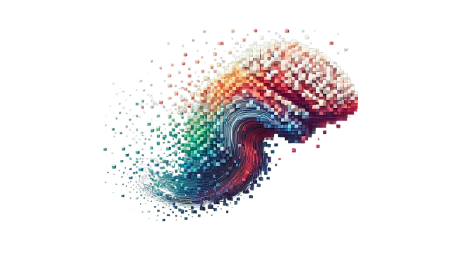

# **Introduction to neurons.me**
> **Empowering Users with Self-Sovereign AI**

**neurons.me is designed to give users control over their AI.** Instead of hidden algorithms manipulating behavior for profit, **neurons.me** ensures **you** define and manage your intelligence to serve your goals

So instead of being passively shaped by AI systems **built for corporations**, **this ecosystem** lets you **actively build and control** the intelligence that works for you.

## **Go Algorithmic.**
We believe **algorithms should work for you—not control you.**
Unlike **AI** that exploits user data for profit, **neurons.me** puts AI in your hands, ensuring it serves **your** goals, not hidden business models.

- **Your algorithm, your rules.** AI should serve you, not control you.
- **Data belongs to you.** Own your datasets and shape your intelligence.
- **Full transparency.** No black-box manipulation—only clear, user-driven intelligence. You **see** how the algorithm operates

**AI should ensure sovereignty over **data and **algorithms**. Hidden models shouldn’t dictate how intelligence evolves around us.
> **The code is the ultimate truth.** If you can see the code, you can trust the system.

## **Core Projects**

| **Project**     | **Purpose**                                                  |
| --------------- | ------------------------------------------------------------ |
| **All.This**    | A framework for modular **data structuring**, optimizing ML pipelines. |
| **neurons.me**  | The **intelligence core**—processing structured data into adaptive AI. |
| **i.mLearning** | A system for users to **create, manage, and refine datasets** for ML. |
| **this.me**     | A user-centric system providing **visibility into AI processes** and dataset evolution. |
| **Cleaker**     | A **decentralized identity** and authentication system for dApps. |
| **Netget**      | A **peer-to-peer networking** solution for fully independent AI applications. |

## **How It Works**
A **.me (user)** structures their data through **i.mLearning**, using **All.This** for efficient data handling. The curated datasets then feed into **neurons.me** for deep learning. **AI** training and adaptation remain **fully visible to the user**, ensuring they understand and **control their own learning processes.**

## **Key Takeaways**
1. **User-centric approach**: `neurons.me` prioritizes user control and autonomy over AI decision-making processes.
2. **Transparency and visibility**: The ecosystem ensures users can see how algorithms operate and make decisions.
3. **Data ownership**: Users retain ownership and control over their data, which is used to train AI models.
4. **Modular architecture**: The ecosystem consists of multiple projects, each serving a specific purpose, such as data structuring, intelligence core, and decentralized identity.

## **Our Philosophy**
- **Your algorithm, your autonomy.** You should see how AI shapes your experience.
- **Own your intelligence.** Your data trains your AI—not someone else’s business model.
- **Interoperability is key.** Every component integrates seamlessly for **user-driven deep learning**.

## **Join the Movement**
**Your AI, your rules. Join neurons.me, fork the code, and take control. 🚀**
**License & Policies**
**Learn more at: ** https://neurons.me
  [Terms](https://docs.neurons.me/terms-and-conditions) | [Privacy](https://docs.neurons.me/privacy-policy)

  
