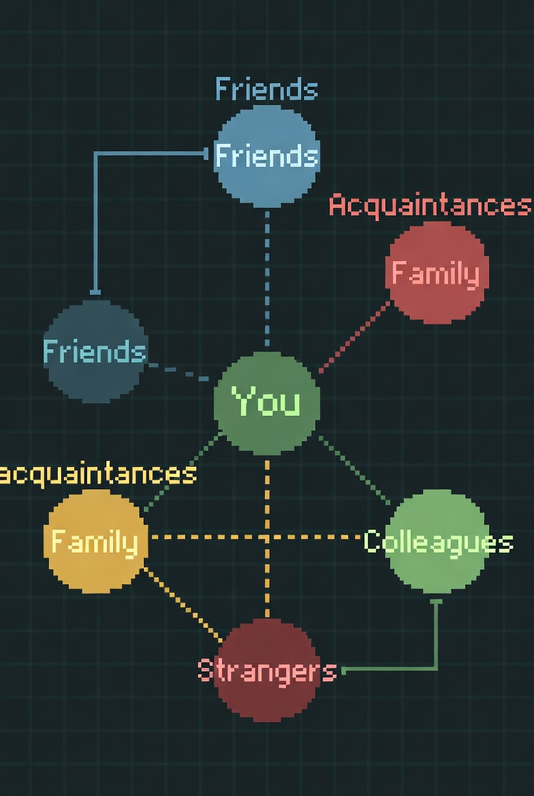

# **Welcome to .me**
> **Own your intelligence.**

<picture>
  <source media="(prefers-color-scheme: dark)" srcset="https://res.cloudinary.com/dkwnxf6gm/image/upload/v1778177581/ChatGPT_Image_May_7_2026_12_12_28_PM_xzkwtc.png">
  
</picture>

# **Go Algorithmic.**
Build **artificial intelligence** that reveals its logic — **evolve it consciously and collectively.**

The entire process of **AI training** and adaptation remains **fully transparent**, allowing users to understand, audit, and **control their own learning systems and relationships.**

Actively **build, evolve, and direct** the intelligence that works for **.us.**

#### .me ∴ Your mind, running locally.

<table>
<tr>
<td width="33%" valign="top" align="center">
  
<b>Robots that Understand Context</b> 
Same object means something completely different depending on who is looking at it.  
<a href="https://neurons-me.github.io/.me/docs/Robots-That-Understand-Context.html"><kbd>Learn more →</kbd></a>
</td>
<td width="33%" valign="top" align="center">
  
<b>Smart Cities</b> 
Living infrastructure coordinated through reactive knowledge graphs.
<a href="https://neurons-me.github.io/.me/docs/Smart-Cities.html"><kbd>Learn more →</kbd></a>
</td>
<td width="33%" valign="top" align="center">
  
<b>Social Networks</b> 
Explainable relationship networks built on human connection.
</td>
</tr>
<tr>
<td width="33%" valign="top" align="center">
  
<b>Encrypted Audience Algebra</b> 
Who can see what, derived — not declared. Audience as algebra over secret scopes.  
<a href="https://neurons-me.github.io/.me/docs/Algebra-of-Contexts.html"><kbd>Learn more →</kbd></a>
</td>
<td width="33%" valign="top" align="center">
  
<b>Wallet Split</b> 
Two friends share a trip wallet — split logic derived automatically from raw contributions.  
<a href="https://neurons-me.github.io/.me/Typescript/typedocs/examples/WalletSplit.html"><kbd>Learn more →</kbd></a>
</td>
<td width="33%" valign="top" align="center">
  
<b>Affinity Model</b> 
Affinity is emergent — store reactions, derive affinity as executable graph logic.  
<a href="https://neurons-me.github.io/.me/Typescript/typedocs/examples/Affinity-Model.html"><kbd>Learn more →</kbd></a>
</td>
</tr>
</table>

## Benchmarks

<table>
<tr>
<td width="33%" valign="top" align="center">
<a href="https://github.com/neurons-me/.me/tree/main/Typescript/tests/Phases">
<b>Phase 2 · Disk & Write Pressure</b>
</a> 
Incremental disk persistence, explain-lookup latency, sustained write/rewrite pressure on the kernel.
</td>
<td width="33%" valign="top" align="center">
<a href="https://github.com/neurons-me/.me/tree/main/Typescript/tests/Phases">
<b>Phase 3 · Vector Search</b>
</a> 
Exact vs. IVF semantic search at scale — corpus, tuning, and cascade-dependency benchmarks.
</td>
<td width="33%" valign="top" align="center">
<a href="https://github.com/neurons-me/.me/tree/main/Typescript/tests/Benchmarks">
<b>Secret Scope & Scaling</b>
</a> 
Push vs. pull and public vs. secret-scope cost — p50/p95/p99 latency baselines across node counts.
</td>
</tr>
</table>

  <i>Meaning is infrastructure.</i>

